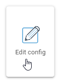
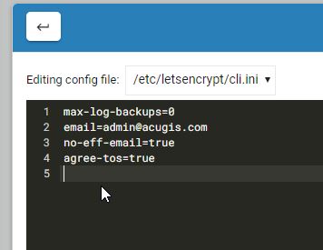

.. This is a comment. Note how any initial comments are moved by
   transforms to after the document title, subtitle, and docinfo.

.. demo.rst from: http://docutils.sourceforge.net/docs/user/rst/demo.txt

.. |EXAMPLE| image:: static/yi_jing_01_chien.jpg
   :width: 1em

**********************
Configuration
**********************

.. contents:: Table of Contents
Access
==================

You can access the Configuration tab via Certbot > Edit Config

Editing
================== 

The editor function provides editing for /etc/letsencryprt/cli.infi as show below:

In this file, you can add/edit command line ini elements:

.. code-block:: console
   :linenos:

max-log-backups=0
email=admin@domain.com
no-eff-email=true
agree-tos=true

When you have completed your edits, click the "Save and Close" button.

