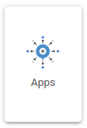

.. This is a comment. Note how any initial comments are moved by
   transforms to after the document title, subtitle, and docinfo.

.. demo.rst from: http://docutils.sourceforge.net/docs/user/rst/demo.txt

.. |EXAMPLE| image:: static/yi_jing_01_chien.jpg
   :width: 1em

**********************
General
**********************

.. contents:: Table of Contents
Edit Config
=============

.. image:: _static/config-tab.png

The Config tab is used to edit the following files::

   server.xml
   web.xml
   context.xml
   tomcat-users.xml
   setenv.sh
   
These files can, of course, be edited via the file system or VI as well.

Apps
====

The Apps manager allows you to deploy, undeploy, and redeploy WAR files in Apache Tomcat

   
Java
=========
.. image:: _static/java-tab.png

The Java tab is used during installation as well as for updating of JDK.

It can also be used to un-install the selected JDK and replace it with a new version.

.. image:: _static/java-installed.png

.. note::
    When installing or removing, there is an option to set as System default.

MapJS
=========

The MapJS tab is simply a file browser for viewing and editing both OpenLayers and LeafletJS files.

