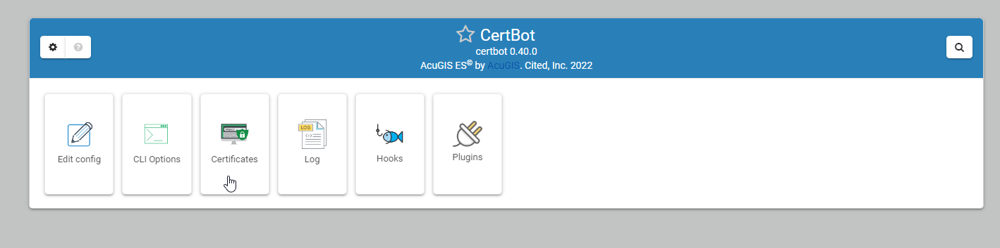
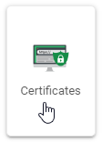
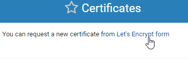
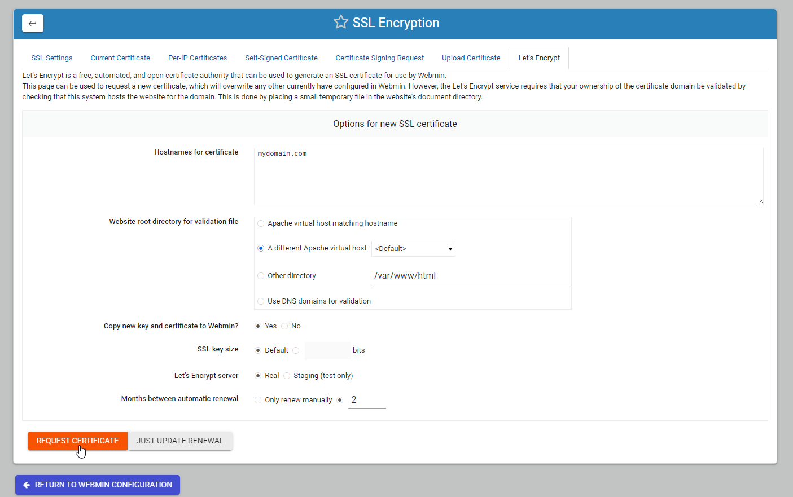

.. This is a comment. Note how any initial comments are moved by
   transforms to after the document title, subtitle, and docinfo.

.. demo.rst from: http://docutils.sourceforge.net/docs/user/rst/demo.txt

.. |EXAMPLE| image:: static/yi_jing_01_chien.jpg
   :width: 1em

**********************
General
**********************

.. contents:: Table of Contents
Layout
=============

Once installed, the CertBot module will look as below:

For the Impatient
====================

To install an SSL certificate, click on Certificates

Click on Letsencrypt form link:

Enter the domain to be secure, the VHOST location and click "Request Certificate"

Return to the Certificates tab to get certifcate file locations as show below

.. image:: certbot-request-4

Add file locations to Apache as shown below:

.. image:: certbot-request-5

  
.. note::
    LetsEncrypt limits the number of requests per IP.  If you get an error, be sure to examine logs before making additional requests

