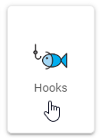
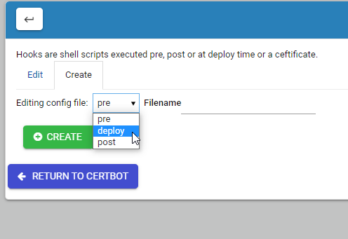

.. This is a comment. Note how any initial comments are moved by
   transforms to after the document title, subtitle, and docinfo.

.. demo.rst from: http://docutils.sourceforge.net/docs/user/rst/demo.txt

.. |EXAMPLE| image:: static/yi_jing_01_chien.jpg
   :width: 1em

**********************
Hooks
**********************

.. contents:: Table of Contents
Access
==================

You can access the Hooks tab via Certbot > Hooks

Editing
================== 

The Hooks form allows you to add and edit Hooks

As shown above, Hooks can be added as pre or post validation hooks, as well as deploy.

For more information on Hooks, visit:
https://eff-certbot.readthedocs.io/en/stable/using.html#pre-and-post-validation-hooks
