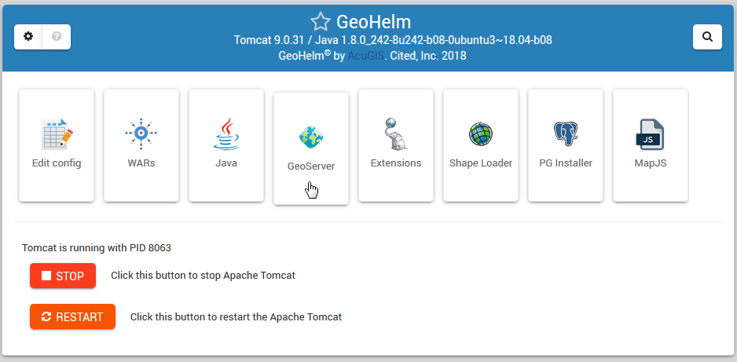

Intro
===========================

Overview
------------

GeoHelm is a Webmin Module that allows you to build a full Open Source GIS stack quickly and easily.

GeoHelm installs and configures PostgreSQL, PostGIS, GeoServer (optionally), Tomcat, and JDK.

It includes a panel for managing all aspects of the service.

GeoHelm can be installed on CentOS 7 or Ubuntu 18.

All installed components are non-forked and un-modified and installed via the projects archive.

System Requirements
-------------------
* CentOS 7 or 
* Ubuntu 18
* Webmin
* 1 GB Ram
* 10 GB SSD

Authors
-------
* `David Ghedini`_
* `Kaloyan Petrov`_

.. _`David Ghedini`: https://github.com/DavidGhedini
.. _`Kaloyan Petrov`: https://github.com/kaloyan13

Components
----------

`PostgreSQL`_

.. _`PostgreSQL`: https://www.opal-consulting.de/downloads/free_tools/JasperReportsIntegration/ 

`PostGIS`_

.. _`PostGIS`: https://community.jaspersoft.com/project/jasperreports-library 

`Apache Tomcat`_

.. _`Apache Tomcat`: http://tomcat.apache.org/ 

`OpenJDK`_

.. _`OpenJDK`: https://openjdk.java.net/

`GeoServer`_

.. _`GeoServer`: https://openjdk.java.net/
 

Open Source
-----------

GeoHelm is Free, Open Source Software.

GNU GENERAL PUBLIC LICENSE v3

    

