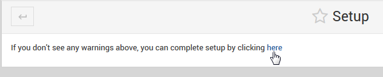

.. _wizard-label:

************
Wizard
************

Once the module is installed, the Wizard is used to configure the components.

Go to Servers > Certbot:

The main Wizard screen will have a link for completing each step.

The steps are self-explanatory, accept each step until no warnings remain:

**Complete Installation:**

Once each step of the Wizard is completed, the Wizard can be removed:

With the Wizard completed, your module should appear as below:

.. image:: _static/certbot-Main.png

