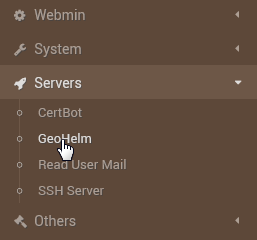
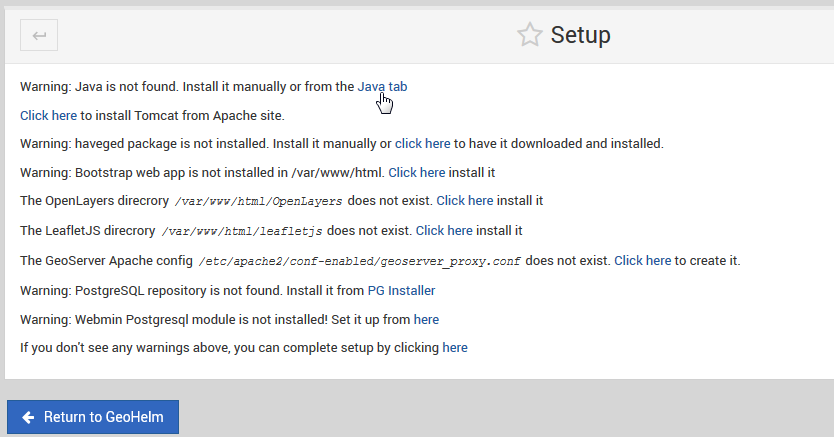
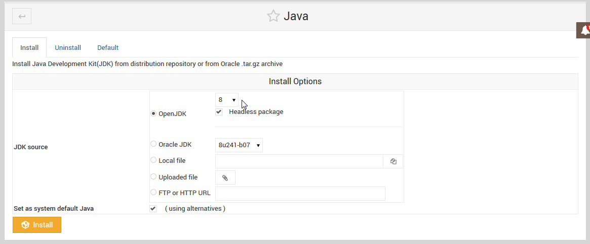
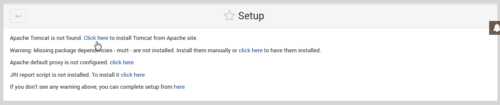
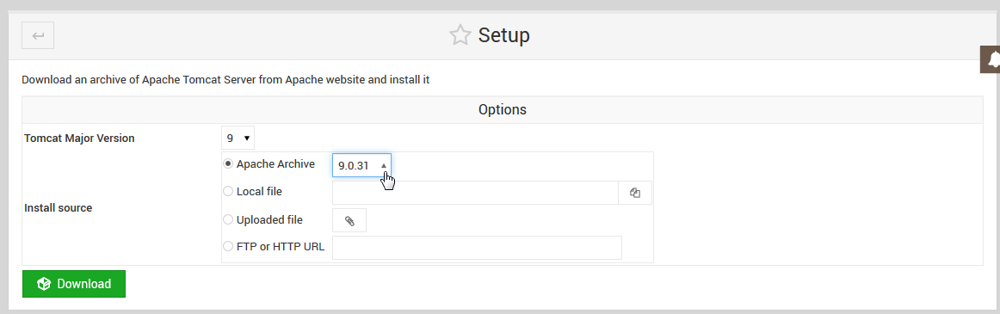
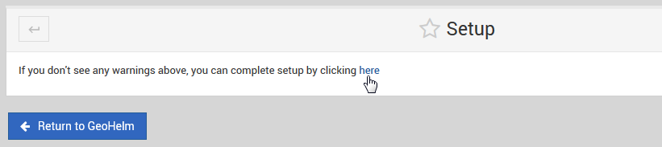
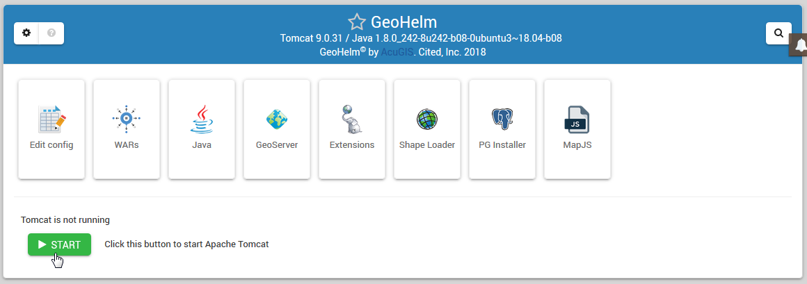

.. _wizard-label:

************
Wizard
************

Once the module is installed, the Wizard is used to configure the components.

Go to Servers > Geohelm:

The main Wizard screen will a link for completing each step.

While most steps are self-explanatory, we will cover Tomcat and JDK selection below:

**Install Java/JDK:**

Select the JDK you wish to use.  We have tested with JDK 8

Geohelm has been tested with OpenJDK 8 and Oracle JDK 8.

**Apache Tomcat:**  

Geohelm has been tested with Apache Tomcat 8.x and 9.x:

**Complete Installation:**

Once each step of the Wizard is completed, the Wizard can be removed:

With the Wizard completed, your module should appear as below:

.. note::
    The Wizard may state that GeoServer is not deployed.  This is due to Tomcat not starting automatically.  Simply complete        installation and start Tomcat to deploy the GeoServer war.
    

About Haveged
===================

Haveged is an entropy generator that will provide markedly faster JVM startup times.
The caveat is that it will use much higher CPU load (although for shorter duration due
to decreased JVM start up time).  Bear this in mind if deploying on VM with limited CPU
or other critical applications.

